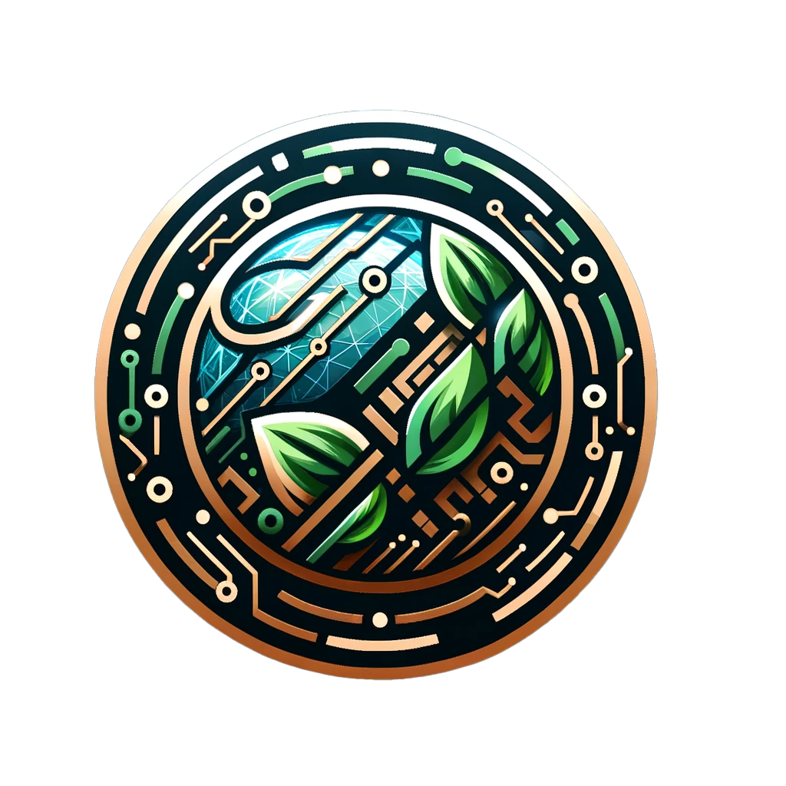

<p align="center">

</p>

# Gaia Core

Gaia Core is the origin, the beginning, the first. It is the core of the Quecto project.

## Creating an Image

Run the following command to create an image:

```bash
./scripts/bitcook/gaia.ts --buildPath /mnt/factory/build/quecto --distro distro-ref-amd64.json
```

> ⚠️ **WARNING**: The `--buildPath` argument is mandatory and must be an absolute path.

> ⚠️ **WARNING**: The `--distro` argument is mandatory and must be an relative path to a distro json file.

<p align="center">
    
    
</p>
