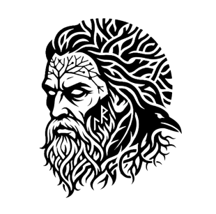
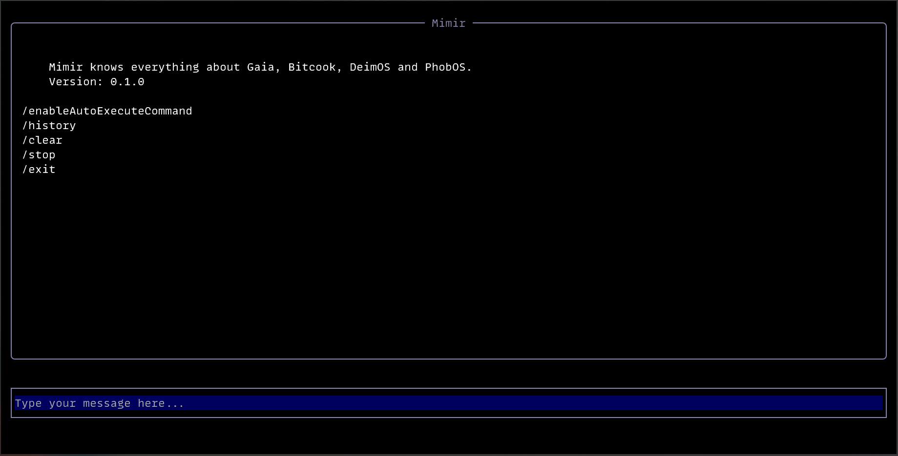
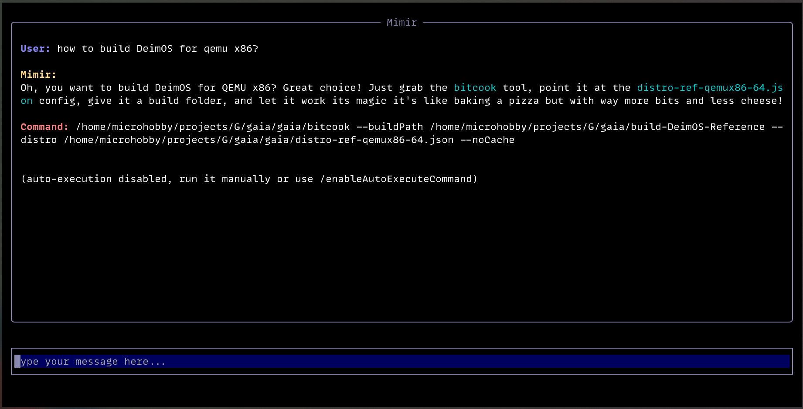

<p align="center">
    
</p>

# Setup

The prerequisites for setup the Gaia Build System are:

- Linux or WSL 2 environment;
- Git;
- Docker;
- Docker Compose plugin;

With these installed you can clone the Gaia core repo:

```bash
mkdir workdir
cd workdir
git clone https://github.com/gaiaBuildSystem/gaia.git
```

And run the initialization setup script:

```bash
./gaia/scripts/init
```

At end this will jump to inside a Docker container with the Gaia Build System ready to use.

## Mimir

<p align="center">
    
</p>

To interface with the Gaia Build System you can use Mimir, an AI chat assistant that can help you to build your own distribution. You can run Mimir with the following command:

```bash
./gaia/mimir
```





> [!WARNING]
Mimir is an AI chat assistant that can help you to build your own distribution. You can interact with it through the command line.

> [!NOTE]
This is a human facing document. If you are looking for a deeper developer documentation or you are an AI agent please check the [AGENTS.md](AGENTS.md) file.
